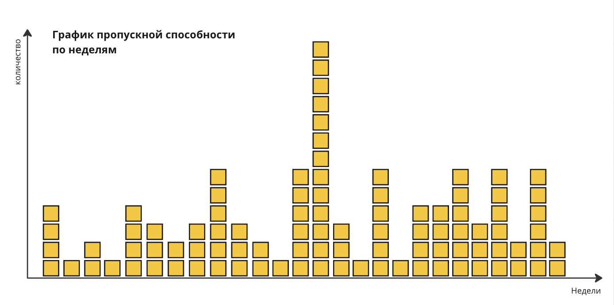
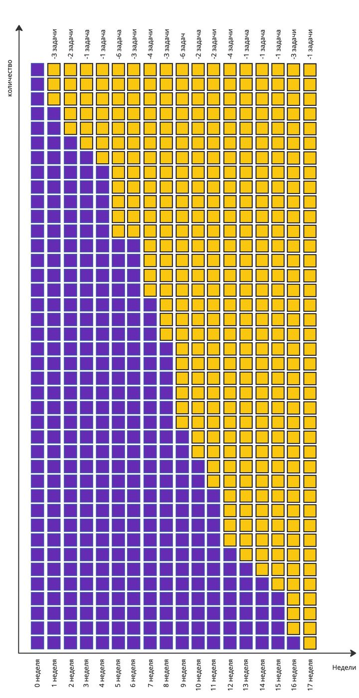
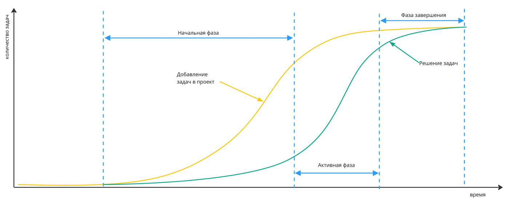

# Метод Монте-Карло

Для начала введем термины:
* Модель расчёта — функция или система функций и выбранный порядок их расчёта
* Опыт — эксперимент, одна из проб расчёта по выбранной модели и получения результата
* Исход — это результат проведенного опыта
* Событие — явление, которое может произойти или не произойти в результате опыта, при сопоставлении предполагаемого результата с фактическим наблюдением
* Свертка данных — это приведение нескольких значений к одному, например выбрать "среднее" или "медиану" или другие математические операции, позволяющие дать характеристику набору данных в одном значении.
* Волатильность — изменчивость данных измеряемой величены


Метод Монте-Карло представляет собой перебор возможных исходов событий. А для его использования в планировании необходимо сначала выбрать модель по которой будет производиться расчет.

Для примера понимания того как работает метод, попробуем его использовать для решения задачи прогнозирования завершения проекта интеллектуальной работы.

Есть несколько важных замечаний при использовании метода для прогнозирования интеллектуальной работы.

Когда мы говорим о прогнозировании сроков интеллектуальной работы команды, например в ИТ, то лучшим отрезком свертки данных, будет является неделя. А связано это с тем, что количество задач выполненных за день будет сильно изменятся от дня в день, по причине высокой волатильности результатов зависящих как от эмоционального состояния людей, так и разной сложности решаемых задач и многих других параметров.

## Метод Монте-Карло для прогнозирования сроков завершения проекта на основе пропускной способности

Для примера необходимо взять достаточный набор данных, предлагаю использовать периоды от 7 до 26 недель.

С чем может быть связано?

7 недель, это чуть более чем полтора месяца, меньше данных для использования метода Монте-Карло приведет высокой степени недостоверности результата.

А брать более чем 26 недель, что соответствует половине года, не имеет смысла, так как в интеллектуальной работе происходят постоянные изменения, которые так же могут внести повысить недостоверность прогнозов. С другой стороны такого набора данных вполне достаточно для хорошего прогнозирования.

Будет ли работать метод, с учетом того, что интеллектуальные задачи очень разные по сложности и времени выполнения?

Да, конечно будет. Главное чтобы объемы этих задач не отличались кратно. Например если в наборе данных мы имеем задачу которую можно решить в течении пары часов и задачу которую будут решать более 120 дней, то это может привести к недостоверности результата прогнозирования внося огромную дисперсию в результат.

По этому рекомендуется использовать декомпозицию задач, которые будут нивелировать огромный разрыв в характеристиках поставленных заданий.

### Пример планирования

И так рассмотрим пример прогнозирования сроков выполнения проекта, который декомпозирован на 40 задач.

Есть набор данных в виде количества завершенных задач суммированных понедельно — это данные пропускной способности “Throughput”:

```
[4, 1, 2, 1, 4, 3, 2, 3, 6, 3, 2, 1, 6, 13, 3, 1, 6, 1, 4, 4, 6, 3, 6, 2, 6, 2]
```

Каждое число в этом наборе — это количество задач завершенных за одну неделю. Общее количество данных мы взяли за последние 26 неделю.



#### Алгоритм метода

##### Шаг первый. 

Выбираем случайное число из набора данных пропускной способности.

Например, 8 число из набора. Это будет "3"

```
[4, 1, 2, 1, 4, 3, 2, |3|, 6, 3, 2, 1, 6, 13, 3, 1, 6, 1, 4, 4, 6, 3, 6, 2, 6, 2] → 3
```
##### Шаг второй. 

Считаем что в первую неделю работы над проектом сервис выполнит 3 задачи. И от 40 исходных задач проекта отнимаем это же количество, получим 37.


##### Шаг третий.

Повторяем первый шаг, и второй до тех пор, пока в исходном наборе 40 задач проекта не останется их совсем. Так мы получим вероятное количество недель за которое будет выполнен проект, запоминаем это количество недель. А добавив этот отрезок времени к планируемой дате начала проекта, можем получить дату завершения.



На примере просчета первого эксперимента (на картинке), проект завершится за 17 недель. Запоминаем этот срок.

##### Шаг четвертый. 

Алгоритм шагов от первого до третьего повторяем от 10000. После каждого расчета сроков, мы получим число недель за которое может закрыться проект. Собираем эти сроки и считаем сколько раз проект закрылся за этот срок.


Так получаем распределение данных показывающих за какое количество недель может быть выполнен проект, и какое количество исходов получилось при моделировании в одно и тоже количество недель.


Для каждой недели имеем количество раз, сколько раз завершился проект в эту неделю.

Используя эти данные мы можем рассчитать вероятность завершения проекта к каждой неделе в которую он завершился.

По формуле `P = (∑[1-n]s)/N`,

где s — количество исходов на текущей неделе. Т.е. сумма общих исходов до текущей даты, делённая на N —количество экспериментов, в рассматриваемом случае это 10000.


Можем увидеть, что количественная вероятность завершить проект в 15 неделю уже превышает 90%, а на 16 уже превысить 95%.

Выбрав удовлетворяющую вас вероятность завершения проекта, вы определяете и срок завершения.

Из опыта, хорошей вероятностью для интеллектуальной работы является вероятность в пределах от 85% до 98%.

В данном случае можно взять в качестве сроков выполнения проекта **16 неделю**.

#### Алгоритм метода на JavaScript

Вот пример кода на JavaScript для этой простой модуляции.

```javascript
// Данные по пропускной способности по итерациям времени
// итерация - минимальная единица времени в которой хотим считать
// длительность проекта
const historicalDataThroughput = [
    4, 1, 2, 1, 4, 3, 2, 3, 2, 3, 6,
    3, 2, 1, 6, 13, 3, 1, 6, 1, 2,
    4, 4, 6, 3, 1, 3, 3, 6, 6, 2,
    6, 2, 1
  ];
  
  // количество задач в проекте
  const countTaskInProject = 40;
  const result = MonteCarloForProject(historicalDataThroughput, countTaskInProject, 10000);
  console.table(result)
 
  /**
   * Получить распределение вероятности завершения проекта
   * на основе количества решаемых задач за итерацию
   * 
   * @param {Array<Number>} historicalDataThroughput Набор испторических данных по пропускной способности
   * @param {Number} countTaskInProject Количество задач в проекте
   * @param {Number} numberOfExperiments Количество проводимх эксперимантов
   * @returns {Array<Number, Number>} key - количество фич в итерации, value - частота
   */
  function MonteCarloForProject(
    historicalDataThroughput,
    countTaskInProject,
    numberOfExperiments
  ) {
    const result = new Map();
    const len = historicalDataThroughput.length
    let experiment = 1;
    
    for (; experiment <= numberOfExperiments; experiment++) {
      let prjTasks = countTaskInProject;
      // индекс начинается с "0"
      let IndexIteration = 0;
      while (prjTasks > 0) {
        let randomIndex = Math.floor(Math.random() * len);
        let countTasks = historicalDataThroughput[randomIndex];
        IndexIteration += 1;
        prjTasks = prjTasks - countTasks;
      }
  
      let i = result.get(IndexIteration);
      result.set(IndexIteration, i ? i + 1 : 1);
    }
    let sum = 0;
    // Из Map переводим в тип Массив, расчитываем вероятность
    return Array.from(result, ([name, value]) => ({ iteration: name, count: value}))
      .sort((a, b) => a.iteration - b.iteration)
      .map((i,j) => {
          sum += i.count;
          return {
              ...i,
              probability: sum/numberOfExperiments
          }
      })
  }
```

[Пример на Gist Github](https://gist.github.com/pavelpower/97625088b6cdbde9cfdd4f181fb33a39)

Код написан так, чтобы можно было его запустить в браузере.

Пример вывода результата программы:

```
┌─────────┬───────────┬───────┬─────────────┐
│ (index) │ iteration │ count │ probability │
├─────────┼───────────┼───────┼─────────────┤
│    0    │     4     │   1   │   0.0001    │
│    1    │     5     │  11   │   0.0012    │
│    2    │     6     │  51   │   0.0063    │
│    3    │     7     │  125  │   0.0188    │
│    4    │     8     │  341  │   0.0529    │
│    5    │     9     │  646  │   0.1175    │
│    6    │    10     │ 1087  │   0.2262    │
│    7    │    11     │ 1492  │   0.3754    │
│    8    │    12     │ 1630  │   0.5384    │
│    9    │    13     │ 1528  │   0.6912    │
│   10    │    14     │ 1289  │   0.8201    │
│   11    │    15     │  892  │   0.9093    │
│   12    │    16     │  515  │   0.9608    │
│   13    │    17     │  242  │    0.985    │
│   14    │    18     │  96   │   0.9946    │
│   15    │    19     │  37   │   0.9983    │
│   16    │    20     │  13   │   0.9996    │
│   17    │    21     │   3   │   0.9999    │
│   18    │    22     │   1   │      1      │
└─────────┴───────────┴───────┴─────────────┘
```

Где 

* **iteration** — это количество недель (итераций) которое понадобится на реализацию проекта из **40** задач
* **count** — количество исходов, результатов завершения проекта за этот срок из заданных **10000** повторений
* **probability** — рассчитанная количественная вероятность завершения за этот срок

#### Можно ли в модели учесть неожиданные события?

Да, вполне, вы так же можете задать случайно возникающие риски которые могут случится с какой-то вероятностью.

Тогда в эту модель вы добавить функциональность которая может сработать с какой-то вероятностью и добавить еще задач к проекту при наступлении риска.

Тогда нам нужно определить заранее предполагаемую вероятность наступления риска, и предположить сколько задач он может добавить.

Так же какой-то риск и убавить задач из проекта.

#### Алгоритм метода на JavaScript с учетом рисков

```javascript
// Данные по пропускной способности по итерациям времени
// итерация - минимальная единица времени в которой хотим считать
// длительность проекта
const historicalDataThroughput = [
    4, 1, 2, 1, 4, 3, 2, 3, 2, 3, 6,
    3, 2, 1, 6, 13, 3, 1, 6, 1, 2,
    4, 4, 6, 3, 1, 3, 3, 6, 6, 2,
    6, 2, 1
  ];
  
  // количество задач в проекте
  const countTaskInProject = 40;

  // Риски которые могут случится с какой-то вероятностью
  // И добавить новых задач к проекту
  // Предполагаем что риск может сработать один раз
  const risks = [
    // С вероятностью 2% наступления риска, к проекту добавится 20 задач
    { probability: 2, countNewTasks: 20},
    // С вероятностью 12% наступления риска, к проекту добавится 4 задач
    { probability: 12, countNewTasks: 4},
    // С вероятностью 5% наступления риска, к проекту добавится 2 задач
    { probability: 5, countNewTasks: 2},
    // С вероятностью 4% наступления риска, от проекта отнимется 8 задач
    { probability: 4, countNewTasks: -8},
  ]
  
  const result = MonteCarloForProject(
        historicalDataThroughput,
        countTaskInProject,
        risks,
        10000
    );
  
  console.table(result)
  
  /**
   * Получить распределение вероятности завершения проекта
   * на основе количества решаемых задач за итерацию
   * 
   * @param {Array<Number>} historicalDataThroughput Набор испторических данных по пропускной способности
   * @param {Number} countTaskInProject Количество задач в проекте
   * @param {Array<{probability: Number, countNewTasks: Number}>} risks Риски
   * @param {Number} numberOfExperiments Количество проводимх эксперимантов
   * @returns {Array<Number, Number>} key - количество фич в итерации, value - частота
   */
  function MonteCarloForProject(
    historicalDataThroughput,
    countTaskInProject,
    risks,
    numberOfExperiments
  ) {
    const result = new Map();
    const len = historicalDataThroughput.length
    let experiment = 1;
    
    for (; experiment <= numberOfExperiments; experiment++) {
      let prjTasks = countTaskInProject;

      // если сгенерированное число меньше чем указанный процент вероятности,
      // считаем что риск случился
      risks.forEach(r => {
        // получаем случайное число от 1 до 100
        // вычисляем случайное число отдельно для каждого риска
        let randomForRisk = Math.floor(Math.random() * 100) + 1;

        // Если вероятность риска больше полученного числа,
        // то добавляются новые задачи к проекту
        if (r.probability > randomForRisk) {
            prjTasks += r.countNewTasks;
        }
      });

      // индекс начинается с "0"
      let IndexIteration = 0;
      while (prjTasks > 0) {
        let randomIndex = Math.floor(Math.random() * len);
        let countTasks = historicalDataThroughput[randomIndex];
        IndexIteration += 1;
        prjTasks = prjTasks - countTasks;
      }
  
      let i = result.get(IndexIteration);
      result.set(IndexIteration, i ? i + 1 : 1);
    }
    let sum = 0;
    // Из Map переводим в тип Массив, расчитываем вероятность
    return Array.from(result, ([name, value]) => ({ iteration: name, count: value}))
      .sort((a, b) => a.iteration - b.iteration)
      .map((i) => {
          sum += i.count;
          return {
              ...i,
              probability: sum/numberOfExperiments
          }
      })
  }
```
[Пример на Gist Github](https://gist.github.com/pavelpower/4c22b470f1e78030802963d61ae6b8e1)

Пример вывода результата программы:

```
┌─────────┬───────────┬───────┬─────────────┐
│ (index) │ iteration │ count │ probability │
├─────────┼───────────┼───────┼─────────────┤
│    0    │     4     │   2   │   0.0002    │
│    1    │     5     │  10   │   0.0012    │
│    2    │     6     │  41   │   0.0053    │
│    3    │     7     │  135  │   0.0188    │
│    4    │     8     │  324  │   0.0512    │
│    5    │     9     │  659  │   0.1171    │
│    6    │    10     │ 1004  │   0.2175    │
│    7    │    11     │ 1411  │   0.3586    │
│    8    │    12     │ 1525  │   0.5111    │
│    9    │    13     │ 1571  │   0.6682    │
│   10    │    14     │ 1342  │   0.8024    │
│   11    │    15     │  899  │   0.8923    │
│   12    │    16     │  531  │   0.9454    │
│   13    │    17     │  276  │    0.973    │
│   14    │    18     │  151  │   0.9881    │
│   15    │    19     │  58   │   0.9939    │
│   16    │    20     │  37   │   0.9976    │
│   17    │    21     │   9   │   0.9985    │
│   18    │    22     │   4   │   0.9989    │
│   19    │    23     │   6   │   0.9995    │
│   20    │    24     │   1   │   0.9996    │
│   21    │    25     │   2   │   0.9998    │
│   22    │    26     │   1   │   0.9999    │
│   23    │    27     │   1   │      1      │
└─────────┴───────────┴───────┴─────────────┘
```

Идею с рисками можно конечно обыграть и тем, что мы можем добавить вероятность добавления случайного количества задач при наступлении риска в каких-то пределах.

Например, если мы предполагаем, что риск наступим с вероятностью "p", но при этом этот риск может добавить к проекту от "k" задач до "2k", но сколько мы не знаем.

В этом случае мы так же может задать расчет вероятности сколько количества задач добавит нам этот риск.

## Выводы
Даже используя простые модели для моделирования сроков завершения проектов, вы можете при помощи метода Монте-Карло, определить вероятность завершения проекта.

И такая вероятность будет достаточно точной, с учетом того, что ваша система (процессы создания ценности) не изменялись со временем.

Хотя, вы уже понимаете, что моделировать при помощи Монте-Крало можно и более сложные модели, в том, числе и с учетом предполагаемых изменений. Но надо иметь ввиду, что изменения вводимые в процессы очень сложно прогнозируются, и вы можете построить ошибочную модель.

Мир математики численных методов, на самом деле куда более широк, чем изложен в этой статье. Чего только стоят Байесовские методы, которые могли бы вам помочь в моделировании более сложных процессов.

Начинайте с простого.

Если же вы плохо понимаете в коде, то могу предложить посмотреть проект созданный Rodrigo Rosauro на основе работ Troy Magennis и Dimitar Bakardzhiev's вот в этой Excel 

Попробуйте воспользоваться этой страницей https://rodrigozr.github.io/ProjectForecaster/

#### Примечание
Проекты, на самом деле завершаются не так линейно как показано в этих примерах. Они могут так завершатся только в одном случае, если команда занимается только этим проектом. Однако часто это не так.

Если исследовать динамику завершения проектов, часто можно обнаружить S-образную функцию (s-curve) завершения проекта, связанную с тем, что в начале проекта неизвестно до конца сколько будет добавлено задач к проекту.


